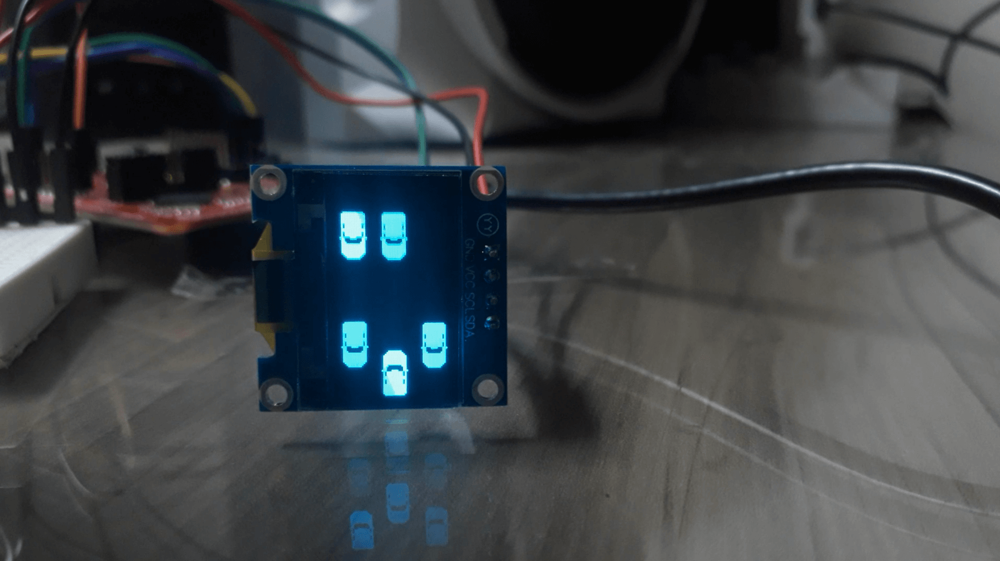
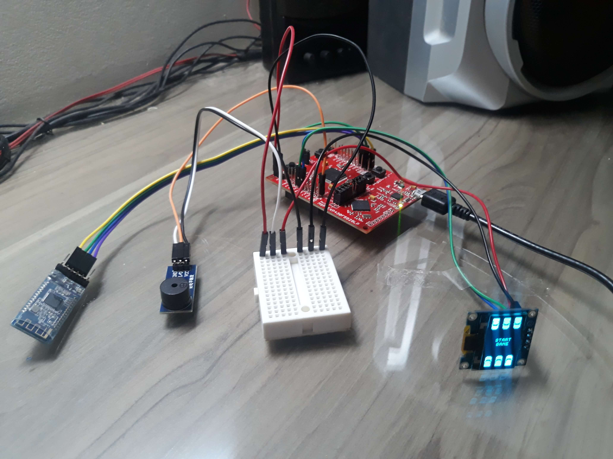

# Projeto final laboratório de SISMIC

    

Jogo desenvolvido utilizado o microcontrolador **MSP430F5529** feito como projeto final da disciplina de Laboratório de Sistemas Microprocessados da UnB no primeiro semestre de 2022.

A disciplina tem o objetivo de familiarizar o aluno com a programação de microcontroladores. É estudado os principais tópicos acerca de
programação para microcontroladores e sistemas embarcados (temporizadores, interrupções,
comunicação serial síncrona e assíncrona, conversão A/D).

## Descrição do projeto

O projeto consiste em um jogo em que o usuário tem que desviar seu carro
dos carros que estão vindo na contramão. O usuário controla a posição do carro
pelo celular através de um aplicativo que se conecta com o módulo bluetooth. A
partir dele, o usuário pode iniciar o jogo, mover o carro para a direita ou para a
esquerda, aumentar ou diminuir o brilho da tela e inverter as cores da tela. O jogo é
exibido em uma tela OLED 128x64.

Existem 3 estados possíveis para o jogo. Inicialmente é apresentada a tela
inicial em que o usuário tem que apertar o botão de START para iniciar o jogo. Após
o jogo ter sido iniciado, é mostrado o carro do usuário e carros avançando na
contramão. Se o usuário bater em um dos carros, ele perde e então é mostrada a
tela de GAME OVER e emitido um bip sonoro por um buzzer indicando que o
usuário perdeu.

## Comandos bluetooth

O programa aceita os seguintes comandos via bluetooth:

-   Mover o carro para a esquerda: '1' (0x31)
-   Diminuir o brilho da tela : '2' (0x32)
-   Iniciar o jogo: '3' (0x33)
-   Inverter as cores da tela: '4' (0x34)
-   Aumentar o brilho da tela: '5' (0x35)
-   Mover o carro para a direita: '6' (0x36)

Para enviar esses comandos, utilizou-se o aplicativo [Serial Bluetooth Terminal](https://play.google.com/store/apps/details?id=de.kai_morich.serial_bluetooth_terminal).

## Conteúdos praticados

O projeto exercita vários dos conteúdos aprendidos durante o semestre, sendo eles:

-   GPIO para configurar os pinos
-   Interrupções de timer e UART
-   Timers, utilizando o _compare mode_ para definir a taxa de atualização do
    jogo/tela e o _output mode_ para emitir o som
-   I2C para comunicação com a tela OLED
-   UART para comunicação com o módulo Bluetooth
-   DMA para transferir os dados para o _buffer_ da tela

## Especificação dos módulos utilizados

### Módulo Display OLED

-   Modelo: SSD1306
-   Interface: I2C
-   Tensão : 3,3 a 5V
-   Resolução: 128x64 pixels
-   Tela: 0,96”
-   Dimensões da tela: 27x15mm

### Módulo Bluetooth

-   Modelo: HM-10
-   Chipset: CC2541
-   Bluetooth: 4.0 BLE
-   Tensão de operação: 3,6 a 6VDC
-   Tensão do sinal: 3,3VDC
-   Sensibilidade típica: –94 dBm a 1 Mbps
-   Interface UART (Universal Asynchronous Receiver/Transmitter) com taxa de
    transmissão programável
-   Taxa de transmissão padrão: 9600, bits de dados: 8, Stop bit: 1, Paridade: sem
    paridade
-   Código de emparelhamento (PINCODE): "000000"

### Módulo Buzzer

-   Buzzer passivo 5V

## Conexões

| OLED | MSP430 |
| :--: | :----: |
| GND  |  GND   |
| VCC  | 3.3 V  |
| SCL  |  P3.1  |
| SDA  |  P3.0  |

| BLUETOOTH | MSP430 |
| :-------: | :----: |
|    GND    |  GND   |
|    VCC    | 3.3 V  |
|    RXD    |  P3.3  |
|    TXD    |  P3.4  |

| BUZZER | MSP430 |
| :----: | :----: |
|  GND   |  GND   |
|  VCC   | 3.3 V  |
|  I/O   |  P2.5  |

## Esquemático elétrico

    

## Imagens

    

    

    

    

